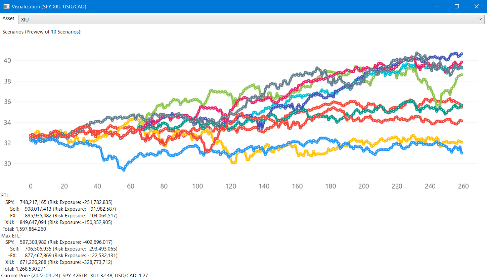

# Portfolio Monte Carlo Simulator

Based off [OTPPInterview2022](https://github.com/chaojian-zhang/OTPPInterview2022), this solution provides a suite of simulation and CLI tools for experimenting with monte-carlo simulation based risk scenario generation. It's used in portfolio risk simulation based on samples from historical returns.

It roughly works as follows

1. Domain 1: Provdes a solution for simulating portfolio risk from a weighted selection of assets (see **Sample Portfolio** section at the end of this page), by extracting 4 quarters of historical data and perform 5000 simulations as projection for future outcome; Those time horizon and scenario size are configurable.
2. Domain 2: Provide both an interactive web GUI and a desktop GUI for playing with numbers.


The automatically generated ETL breakdown provides a preliminary analysis of the factors contributing to the final risk value.

## Overview

There are a few complications in the overall solution (i.e. for Domain 1):

1. **Data downloading and preprocessing**: For manual operations one can download CSV files from the web and manually clean up the data for missing entries and mis-matching dates, but for generic general-purpose API-based data source, the program must be smart enough to automatically handle errors in data. This part of code is mostly done inside `PortfolioAnalyzer` class.
2. **Data simulation and processing**: When proper data is fetched and ready for processing, the actual simulation is quite trivial; This is done with the help of classes inside `Algorithm` namespace.
3. **Report generation**: The actual ETL and MaxETL computations are done by `Reporter` class, which is seperate from the simulation process. It processes the simulated result and perform additional transformations on the return data to obtain risk values.

## How to Run

This solution requires [.Net 7 SDK](https://dotnet.microsoft.com/en-us/download/dotnet/7.0) and the server application uses ASP.Net Core.

For compiling and run:

1. Open *PortfolioMonteCarloSim.sln* in Visual Studio or Rider;
2. Set **RiskTerminal** or **PortfolioBuilder** as starting project;
3. Press *F5* to run; It should take less than a minute to execute after compilation is done; 
4. The outcome will be shown inside the CLI console output and inside a pop-up window.

For standalone use:

* Download and unzip [latest build for windows](https://github.com/Charles-Zhang-Experiments/PortfolioMonteCarloSim/releases);
* Execute either **Desktop/RiskTerminal.exe** or **Server/PortfolioBuilder.exe**;
* For command line parameters, see section on *Risk Terminal* below.

## Future Improvements

- [x] (Done in [commit ada0d2d](https://github.com/Charles-Zhang-Experiments/PortfolioMonteCarloSim/commit/ada0d2d2accaf08e4c1cf43ad6ed83d1980f0372)) The current visualization for CLI program is not showing currency visualization, this would be helpful in understanding the trend; It can be added in future implementation. However, this is available in the website interface.

The risk analytics part of the program can be further improved; That is, for final risk numbers, we can generate contribution from exchange rate for easier analysis. (This is done in a later patch)

There are also some known issues carried from previous implementation: https://github.com/chaojian-zhang/OTPPInterview2022/issues

Input parameters beyond sample data is not fully tested for Risk Terminal.

## Technical Notes

The whole solution is written entirely in C# (with some JavaScript and HTML), and is divided into a few components: 

1. (.Net Core Class Library) PortfolioRisk.Core: Main solution logic;
2. (.Net Core Console Program) Risk Terminal: CLI entrypoint for the solution;
3. (.Net Core Blazor Server Application) Portfolio Builder: Web-based interface for the solution;
4. (.Net WPF Application) ChartViewer: A small utility program providing line chart visualization for simulation outcome.

* PortfolioRisk.Core: This library project provides all shared code logic for the other two programs.
* Risk Terminal: A CLI (Command-Line Interface) program that provides general purpose risk analysis using a command line interface.
* Portfolio Builder: An interactive web app that allows construct and analysis of portfolio risk through web interface. This can be further improved with more sophisticated background worker management when risk data gets large. For the sake of simplicity and demonstration purpose, the web interface was originally built with front-end only technology without depending on a server; This puts some restrictions on computing power and in this case also to the accessibility of Yahoo Finance API due to cross-origin access issues. Ideally for more practical purpose, one would seperate the front-end from the back-end so there is more flexibility in implementation. **Later this is changed to a server-client application however the state management is not fully migrated to a proper server setup with multiple-client facing scenario**.

Offline Data Sources (Folder): The implementation provides automatic ticker historical data fetching capabilities from Yahoo Finance, notice due to the closed-source nature of Yahoo Finance API (official Yahoo Finance API was disabled in 2017), there may be issues with fetching data when unexpected formats are encountered - that's why an offline data source is provided, as described below.

The *PortfolioRisk.Core/OfflineSources* folder contains some sample data, it's used for the first question and provides offline access of data.

## Risk Terminal Command Line (CLI) Use

Command format: `RiskTerminal -t <Total Allocation> -a <Assets> -c <Asset Currency Types> -w <Asset Weights> -f <Factors> -s <Start Date> -e <End Date>` 
Example: `RiskTerminal -t 2,000,000 -a SPY XIU -c USD CAD -w 1 1 -f SPY XIU USD/CAD -s 2017-01-01 -e 2021-12-31`

Use command `RiskTerminal sample` or simply run `RiskTerminal` without any command-line arguments to run the sample some data as in the Example section below.

# Example: Sample Portfolio

The sample portfolio assumes a $CAD2B portfolio with SPY and XIU weighted 1:1. Notce that the quotes for iShare (XIU) is in CAD while SPY is in USD. That's why we have a USD/CAD historical rate for currency conversion purpose. Since both the offline data and Yahoo Finance API data can have missing dates, or otherwise contain mismatching numbers of rows - they need to be cleaned for alignment and contains matching number of rows before being used at later stages of simulation.

Methodology:

1. Data needs clean up, some are back-filled for missing dates, the program also supports forward-fill by grabing from neighbouring future dates in case no historical data is available, though in practice this is not observed for our sample data;
2. For "PnL" calculation, the program currently shows the final projected market value of the asset instead of its actual "loss";

## Analysis

For a *$CAD2B* portfolio with **SPY** and **XIU** weighted *1:1* invested on **2022-04-24**, sampling historical data from **2017-01-01** to **2021-12-31**,below is the summary of the simulated result. The values shown are the final simulated market value in CAD:

```
ETL:
   SPY:    748,217,165 (Risk Exposure: -251,782,835)
     -Self:    908,017,413 (Risk Exposure:  -91,982,587)
     -FX:      895,935,482 (Risk Exposure: -104,064,517)
   XIU:    849,647,094 (Risk Exposure: -150,352,905)
 Total: 1,597,864,260
Max ETL:
   SPY:    597,303,982 (Risk Exposure: -402,696,017)
     -Self:    706,506,935 (Risk Exposure: -293,493,065)
     -FX:      877,467,869 (Risk Exposure: -122,532,131)
   XIU:    671,226,288 (Risk Exposure: -328,773,712)
 Total: 1,268,530,271
Current Price (2022-04-24): SPY: 426.04, XIU: 32.48, USD/CAD: 1.27
```

There are two ways to make sense out of this: graphically and analytically based on constituting components.

Graphically or intuitively (though this screenshot contains only the first 10 scenarios), it just helps to see what those scenarios actually look like:




Another way is to consider the factors - for a total final simulated portfolio value of *1,597,864,260*, *748,217,165* comes from SPY and *849,647,094* comes from XIU. Out of this, since SPY is originally rated in USD, we should also be able to get its risk value in USD and get the USD/CAD exchange rate risk independantly: those are *908,017,413* (SPY with exchange rate not changing) and *895,935,482* (Investment in USD alone without considering changes in SPY price). We can see that *-91,982,587* and *-104,064,517* adds up roughly to *-251,782,835*.

<!--
* XIU
* SPY (USD): SPY Total Return * Initial CAD
* USD/CAD
* SPY (USD) + USD/CAD: SPY CAD * USD/CAD
-->
