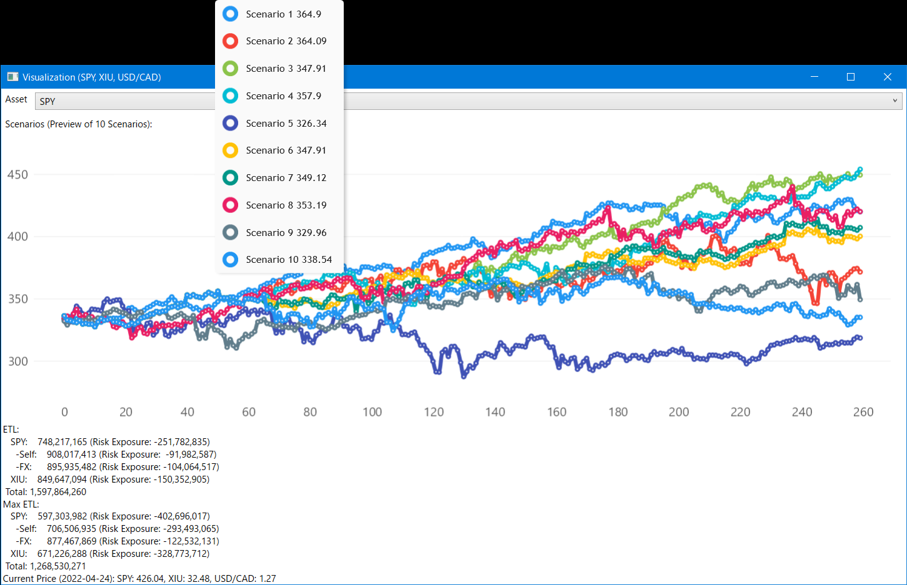
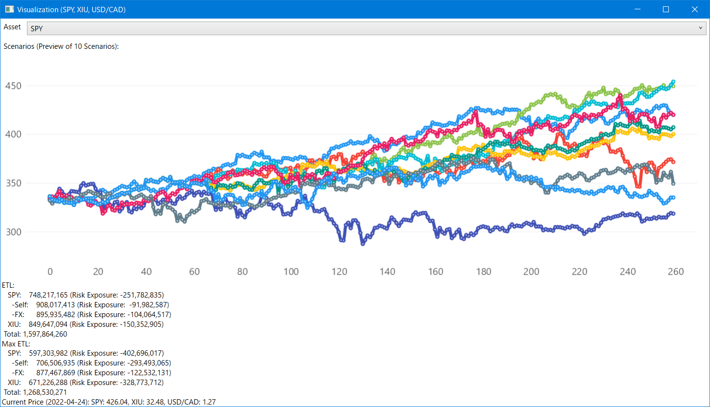

# OTPP Interiew Case Challenge 2022

This repository contains a complete solution for portfolio risk simulation based on samples from historical returns.

It's an implementation of the *Programming Project* for the **Investment Analyst** position at *Total Fund Risk* for OTPP in 2022 April.

The original programming project contains three parts (three questions), a summary of which is provided below:

1. Question 1: Implement a solution for simulating portfolio risk from a weighted selection of assets (see **Sample Portfolio** section at the end of this page), by extracting 4 quarters of historical data and perform 5000 simulations as projection for future outcome;
2. Question 2: Make comments on the legitimacy of the methodology and implementation results;
3. Question 3: Provide a web GUI interface for Question 1.



## Overview

There are two complications in the overall solution (e.g. for Question 1):

1. **Data downloading and preprocessing**: For manual operations one can download CSV files from the web and manually clean up the data for missing entries and mis-matching dates, but for generic general-purpose API-based data source, the program must be smart enough to automatically handle errors in data. This part of code is mostly done inside `PortfolioAnalyzer` class.
2. **Data simulation and processing**: When proper data is fetched and ready for processing, the actual simulation is quite trivial; This is done with the help of classes inside `Algorithm` namespace.

## How to Run

This solution requires [.Net Core SDK 3.1](https://dotnet.microsoft.com/en-us/download/dotnet/3.1) and the server application requires [.Net SDK 5.0](https://dotnet.microsoft.com/en-us/download/dotnet/5.0).

For compiling and run:

1. Open *OTPPInterview2022.sln* in Visual Studio or Rider;
2. Set *RiskTerminal* or *PortfolioBuilder* as starting project;
3. Press *F5* to run, It should take less than a minute to execute after compilation is done; 
4. The outcome will be shown inside the CLI console output and inside a pop-up window.

For standalone use:

* Download and unzip [latest build for windows](https://github.com/chaojian-zhang/OTPPInterview2022/releases/tag/v1.0);
* Execute either **Desktop/RiskTerminal.exe** or **Server/PortfolioBuilder.exe**;
* For command line parameters, see section on *Risk Terminal* below.

For quick online test:

* Go to http://risk.totalimagine.com, it provides the examples in Question 1 as preset.

## Future Improvements

The risk analytics part of the program can easily be improved; That is, for final risk numbers, we can generate contribution from exchange rate for easier analysis.

# Software Components

The whole solution is written entirely in C# (with some JavaScript and HTML), and is divided into three parts: 

1. (.Net Core Class Library) PortfolioRisk.Core: Main solution logic;
2. (.Net Core Console Program) Risk Terminal: CLI entrypoint for the solution;
3. (.Net Core Blazor Web Assembly Application) Portfolio Builder: Web-based interface for the solution;
4. (.Net WPF Application) ChartViewer: A small utility program providing line chart visualization for simulation outcome.

## PortfolioRisk.Core

This library project provides all shared code logic for the other two programs.

## Risk Terminal

A CLI (Command-Line Interface) program that provides general purpose risk analysis using a command line interface.

Command format: `RiskTerminal -t <Total Allocation> -a <Assets> -c <Asset Currency Types> -w <Asset Weights> -f <Factors> -s <Start Date> -e <End Date>` 
Example: `RiskTerminal -t 2,000,000 -a SPY XIU -c USD CAD -w 1 1 -f SPY XIU USD/CAD -s 2017-01-01 -e 2021-12-31`

Use command `RiskTerminal sample` or simply run `RiskTerminal` without any command-line arguments to run the sample data as in Question 1.

## Portfolio Builder

An interactive web app that allows construct and analysis of portfolio risk through web interface. This can be further improved with more sophisticated background worker management when risk data gets large.

For the sake of simplicity and demonstration purpose, the web interface was originally built with front-end only technology without depending on a server; This puts some restrictions on computing power and in this case also to the accessibility of Yahoo Finance API due to cross-origin access issues. Ideally for more practical purpose, one would seperate the front-end from the back-end so there is more flexibility in implementation.

**Later this is changed to a server-client application however the state management is not fully migrated to a proper server setup with multiple-client facing scenario**.

## Offline Data Sources (Folder)

The implementation provides automatic ticker historical data fetching capabilities from Yahoo Finance, notice due to the closed-source nature of Yahoo Finance API (official Yahoo Finance API was disabled in 2017), there may be issues with fetching data when unexpected formats are encountered - that's why an offline data source is provided, as described below.

The *PortfolioRisk.Core/OfflineSources* folder contains some sample data, it's used for the first question and provides offline access of data.

# Sample Portfolio (Question 1 & 2)

The sample portfolio assumes a $CAD2B portfolio with SPY and XIU weighted 1:1. Notce that the quotes for iShare (XIU) is in CAD while SPY is in USD. That's why we have a USD/CAD historical rate for currency conversion purpose.

Since both the offline data and Yahoo Finance API data can have missing dates, or otherwise contain mismatching numbers of rows - they need to be cleaned for alignment and contains matching number of rows before being used at later stages of simulation.

## Methodology

1. Data needs clean up, some are back-filled for missing dates, the program also supports forward-fill by grabing from neighbouring future dates in case no historical data is available, though in practice this is not observed for our sample data;
2. For "PnL" calculation, the program currently shows the final projected market value of the asset instead of its actual "loss";
3. Due to time constraint, the current visualization for CLI program is not showing currency visualization, this would be helpful in understanding the trend; It can be added in future implementation. However, this is available in the website interface.

## Analysis

For a *$CAD2B* portfolio with **SPY** and **XIU** weighted *1:1* invested on **2022-04-24**, sampling historical data from **2017-01-01** to **2021-12-31**,below is the summary of the simulated result. The values shown are the final simulated market value in CAD:

```
ETL:
   SPY:  1,211,746,006
   XIU:    849,664,103
Max ETL:
   SPY:    966,778,569
   XIU:    670,735,737
Current Price (2022-04-24): SPY: 426.04, XIU: 32.48, USD/CAD: 1.27
```

There are two ways to make sense out of this: graphically and analytically based on constituting components.

Graphically speaking (though this screenshot contains only the first 10 scenarios), SPY has a stronger upper trend and XIU is more affected by negative trends.




Another way is to consider the factors - for a total final simulated portfolio value of *2,061,410,109*, *1,211,746,006* comes from SPY and *849,664,103* comes from XIU. Out of this, since SPY is originally rated in USD, we should also be able to get its risk value in USD and get the USD/CAD exchange rate risk.

<!--
* XIU
* SPY (USD)
* USD/CAD
* SPY (USD) + USD/CAD
-->